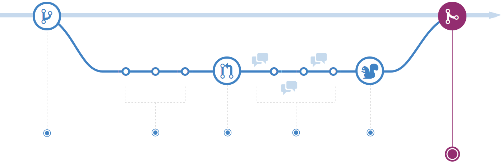

# Система ветвления Github Flow
Для практического задания я реализовал несколько методов для простейших операций с числами.
Каждый новый метод - отдельная фича, которую я создавал в своей ветке.
Использованная мной система ветвления - `Github Flow`, очень удобна для небольших проектов, как этот.
Она представляет собой такую структуру: от `master'a` создаём новую `feature` ветвь тогда, когда хотим добавить новый функционал. Коммитим локально, пока не осознаем, что функционал полностью готов. Затем делаем `push` в удалённый репозиторий и `pull request` к master'у. При этом мы никогда не должны коммитить в `master` просто так. 
## Фиксация изменений

## Запрос на слияние

## Проверка и обсуждение кода

На данном этапе участники команды могут давать советы тому, кто разрабатывает данную ветку, и обсуждать пришедшие изменения.
## Слияние

При слиянии в стволе создаётся фиксация со всеми изменениями из ветки. Как и любые другие фиксации, она доступна для поиска и "перемещения во времени".
# В чём отличие от GitFlow?
В `GitFlow` есть дополнительная ветвь `develop` куда сливаются все разрабатываемые в текущий момент ветви. `develop` необходимо "стабилизировать" перед релизом, что часто приводит либо к переносу релиза, либо "релизу с замечаниями".
# В чём отличие от GitLab Flow?
В `GitLab Flow` вы сначала вливаете ветвь в `master` и лишь потом разворачиваете в тестовом, и других окружениях.
